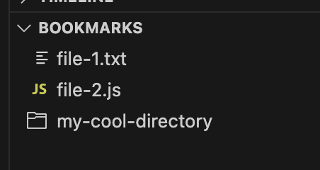

# Explorer Bookmarks

A VSCode extension that lets you Bookmark files and folders in the Explorer.



## Features

- Adds a "Bookmarks" view to the Explorer sidebar
- Add files and folders to bookmarks
- Bookmarks are stored in `.vscode/bookmarks.json`
- Displays bookmarked files and locations

## Publishing

This is really just here for my own reference.

```sh
pnpm run publish minor

```