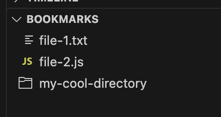

# Explorer Bookmarks

A VSCode extension that lets you Bookmark files and folders in the Explorer.



## Features

- Adds a "Bookmarks" view to the Explorer sidebar
- Add files and folders to bookmarks
- Store bookmarks in `.vscode/bookmarks.json` or workspace preferences
- Displays bookmarked files and locations
- Drag and drop to reorder bookmarks
- Choose VSCode icons for each bookmark
- Context menu options to add/remove bookmarks

## Settings

- `explorerBookmarks.storage`
  - `workspaceFile`: store bookmarks in `.vscode/bookmarks.json`
  - `preferences`: store bookmarks in workspace preferences under `explorerBookmarks.bookmarks`

## Publishing

This is really just here for my own reference.

```sh
pnpm run publish minor
```
